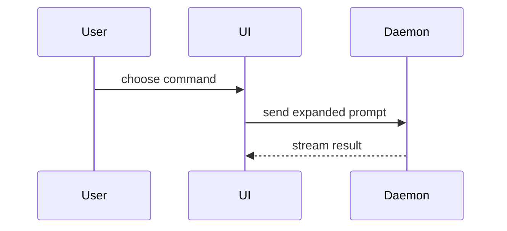

用可视化方式帮助用户理解当前讨论的主题。直接展示内容，文字说明保持简短。选择能讲清关键点的最简视图。

- 用伪代码展示逻辑或算法：

```text
on(save)
  if content is unchanged
    return cached result
  write new content
  return fresh result
```

- 用调用树展示运行时控制流：

```text
submitForm
  createSession
    persistPrompt
    launchAgent
  navigateToSession
```

- 用组件树展示界面结构，包含与当前问题有关的状态和模块边界：

```tsx
<SessionPage> (apps/example/src/routes/session.tsx)
  useSessionEvents()
  <SessionToolbar>
    <RunSkillButton> (packages/ui)
```

- 用层级较浅的文件树展示文件职责或大范围重构：

```text
src/
├── commands/       # parses user actions
├── sessions/       # owns session state
└── transport/      # sends API requests
```

- 用 Mermaid 展示组件交互、控制流或数据流：



- 当重点是说明变化，且已有周边结构可供对照时，使用 `diff`。根据讨论主题选择差异的展示形式。

组件变更：

```diff
 <SessionPage>
   useSessionEvents()
   <SessionToolbar>
+    <RunSkillButton />
   <SessionTimeline>
+    <SkillResultCard />
```

文件布局变更：

```diff
 src/
 ├── commands/
+│   └── show-me.ts       # expands the slash command
 ├── sessions/
-└── transport.ts
+└── transport/
+    ├── client.ts
+    └── stream.ts
```

调用树或调用栈变更：

```diff
 submitForm
   createSession
     persistPrompt
+    expandSkillMention
     launchAgent
-  navigateToSession
+  navigateToSession
+    subscribeToEvents
```

状态或控制流变更：

```diff
 on(save)
-  write content
+  if content is unchanged
+    return cached result
+  write new content
+  invalidate cache
```

- 当大部分内容是新增的、省略上下文会掩盖归属或执行顺序，或用户需要可直接复制的目标结构时，展示完整内容：

```ts
function expandSkill(command: string): string {
  const skillName = command.slice(1)
  return `use the ${skillName} skill`
}
```

- 对于界面、布局、状态对比，或信息过于密集而不适合用 Mermaid 展示的概念，编写一个聚焦当前主题的 HTML 文件。根据内容选择图表、信息图或简短幻灯片。沿用产品的配色、字体、间距和组件，使用真实标签与数据，同时适配桌面端和移动端。完成后为用户打开：

```
Bash(open path/to/show-me-{description}.html)
```

### 使用原则

将每个可视化内容放在对应的简短说明旁边。只保留回答用户当前问题或说明当前讨论中备选方案所需的调用、文件、组件属性、状态和边界。

可以选用一种或几种展示方式，通常无需全部使用。根据实际需要选择，避免一次展示过多内容。
