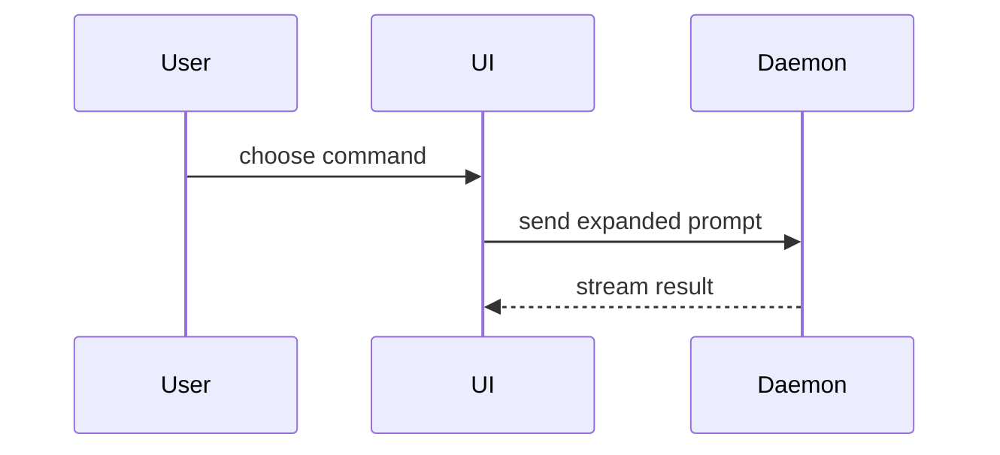

# 可视化形式示例

只读取与当前问题对应的示例，不需要同时使用多种形式。

## 伪代码

```text
on(save)
  if content is unchanged
    return cached result
  write new content
  return fresh result
```

## 调用树

```text
submitForm
  createSession
    persistPrompt
    launchAgent
  navigateToSession
```

## 组件树

```tsx
<SessionPage> (apps/example/src/routes/session.tsx)
  useSessionEvents()
  <SessionToolbar>
    <RunSkillButton> (packages/ui)
```

## 文件树

```text
src/
├── commands/       # parses user actions
├── sessions/       # owns session state
└── transport/      # sends API requests
```

## Mermaid 时序



## 聚焦差异

```diff
 on(save)
-  write content
+  if content is unchanged
+    return cached result
+  write new content
+  invalidate cache
```

差异只保留理解变化所需的周边结构。大部分内容都是新增、或省略上下文会掩盖归属和顺序时，展示完整目标结构。
